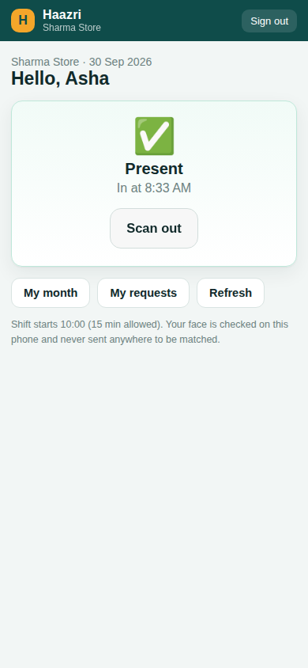
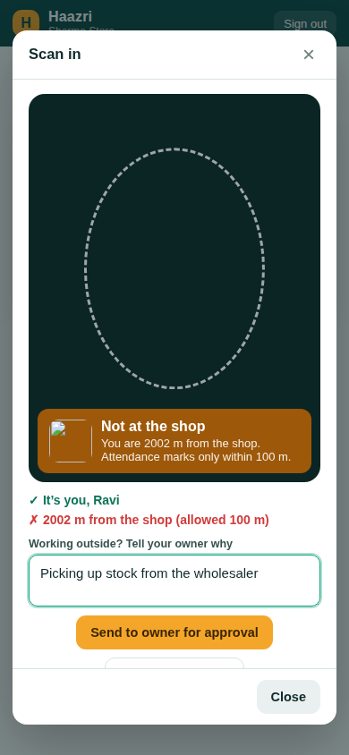
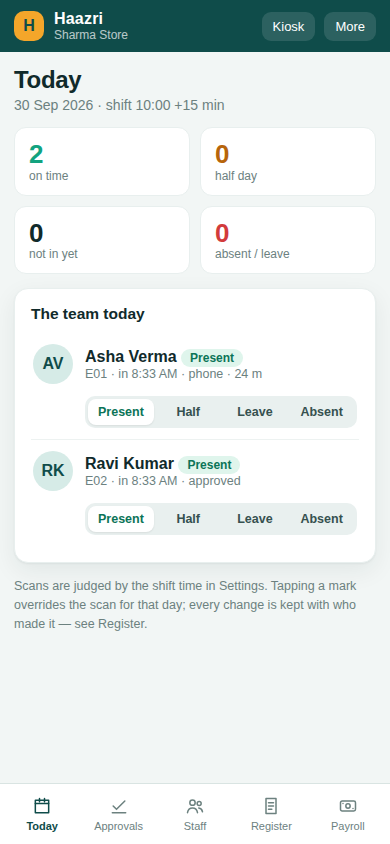
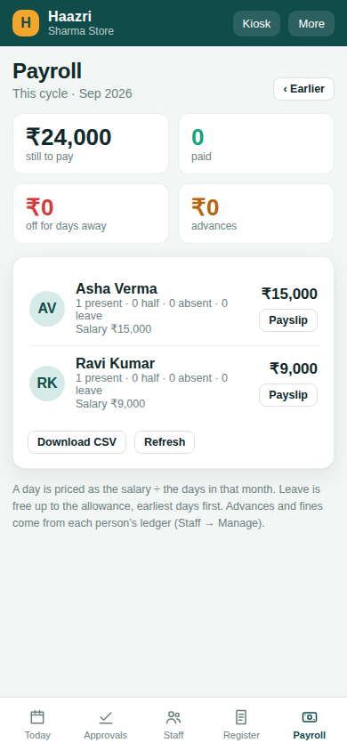

# Haazri: face and location attendance for small shops

> **Moved.** Haazri now lives inside the mirrorBill repository, in
> `haazri/`, and is served at **mirrorbill.com/haazri** as "Haazri by
> mirrorBill". That copy has the licence, Razorpay payments, the new logo
> and the CDN-served face model. This repository is the original prototype
> and is no longer updated.

*हाज़िरी, "attendance"*

A separate, attendance-only product built from mirrorBill's attendance,
face-scan and payroll code, with a new feature: **staff mark attendance
from their own phone, and it only counts inside the shop's perimeter.**

- **Staff** sign in on their own phone with a shop code, an employee ID
  and a 6-digit PIN. They tap **Scan in** and look at the camera.
  - The face is checked on the phone against the face the owner
    registered for that login.
  - The GPS location is checked against the shop's perimeter (a radius the
    owner picks: 25 m to 1 km).
  - **Inside the perimeter:** marked present at once, using the server's
    clock (the phone can't fake the time).
  - **Outside the perimeter:** nothing is marked. The employee can send the
    scan to the owner with a reason ("went to the bank for the shop") and a
    small photo of the moment. The owner **approves** it (the day is marked
    at the time it was sent) or **turns it down**.
  - **Scan out** when leaving records the leaving time.
- **Owner** sees today live, approves outside scans, manages staff and
  their faces, keeps the register (any day, every change logged with who
  made it), and runs **payroll**: salary, half days, absences, paid leave
  allowance, advances, fines, bonus, mark paid, and a payslip to share on
  WhatsApp.
- **Door kiosk** (from mirrorBill): one phone or tablet at the door
  recognises everybody, for staff without a smartphone. It locks behind the
  owner's password.

| Employee, marked | Employee, outside the perimeter | Owner, today | Owner, payroll |
|---|---|---|---|
|  |  |  |  |

## What it costs to run

**₹0 a month** for 100 shops (8 or 15 staff each), and for 200 shops of 15
staff it's still ₹0 but close to the free limit. Face matching runs on the
phone, so there's no per-scan charge. Location uses the phone's GPS, not a
paid maps API. Full breakdown, and what to do past 200 shops:
**[docs/COST.md](docs/COST.md)**.

## Setting up (once)

1. **Create a new Firebase project** at console.firebase.google.com, for
   example `haazri-app`. Keep it separate from mirrorBill's project so the
   free quotas aren't shared. Stay on the free **Spark** plan.
2. **Authentication → Sign-in method →** enable **Email/Password**.
3. **Firestore Database → Create**, production mode, region **asia-south1
   (Mumbai)**.
4. **Project settings → Your apps → Web app**, then copy the config into
   `js/config.js`.
5. Deploy the security rules and indexes:
   ```sh
   npm install
   npx firebase login
   npx firebase use --add        # pick the new project
   npx firebase deploy --only firestore
   ```
6. **Host the site on Cloudflare Pages** (free, unlimited bandwidth; see
   COST.md for why not Firebase Hosting):
   Cloudflare dashboard → Workers & Pages → Create → Pages → connect this
   GitHub repo. Build command: *(none)*. Output directory: `/`.
   Camera and GPS both need **https**, which Pages gives you.

Then open the site, choose **I own the shop → Open a new shop**, and follow
the "Getting started" steps on the Today screen.

## How a shop starts using it

1. The owner opens a shop, stands inside it, and taps **Settings → Use where
   I am now**, then picks the radius. **Test: am I inside?** checks it.
2. **Staff → Add staff.** Each person gets an ID (E01, E02…) and a PIN, and
   **Send on WhatsApp** sends them their login.
3. **Register each face**, in person, on the owner's phone: three pictures.
   Staff can't register their own face (otherwise anybody could register a
   friend to scan for them).
4. Staff open the link on their phone, **Add to Home Screen**, and scan in
   every morning.

## Honest limits

- **Fake-GPS apps** on Android can lie about location, and a web page can't
  detect them. What protects you: the face must match that login, the time
  is the server's, and the distance is shown to you on every scan. For
  shops where this matters, turn on *Keep a small picture of every scan*
  or use the door kiosk.
- **No liveness check.** A clear photo of the person held up to the camera
  may pass the face match. The same mitigations apply.
- Phones indoors are often 20–50 m off. A radius under 50 m will send
  honest staff for approval now and then. **100 m is the recommended
  default.**
- Scanning needs an internet connection at that moment (the time comes
  from the server).

## What came from mirrorBill

Ported, and kept to the same rules:

- `js/face.js`: the face engine, thresholds, "come closer", and the check
  that stops two people being registered with the same face.
- The door kiosk, face registration, and the register with its change log.
- Payroll rules: a day priced against its own month, paid leave spent
  earliest-first, "no scan means leave" only on days the shop was open,
  the late rule, pay days that don't slide in short months, and payouts
  that settle the cycle they name.
- `js/ui.js`, reduced to helpers only.

New:

- Perimeter checks (`js/geo.js`), the staff phone login, outside-scan
  approvals, the server-time rules, and a new read-light Firestore layout
  (`js/store.js`).
- New colour palette: deep teal, saffron and leaf green, replacing
  mirrorBill's violet and rose.

## Layout

```
index.html            the app (staff and owner, one page)
js/config.js          Firebase config — paste yours here
js/store.js           all Firestore reads/writes (shaped for the free plan)
js/pay.js             pure payroll + day rules (unit-tested)
js/geo.js             perimeter maths (unit-tested)
js/face.js            on-device face recognition (from mirrorBill)
js/employee.js        the staff phone screen
js/owner-*.js         owner screens
firestore.rules       who can read/write what (rules-tested)
vendor/               face-api + models (MIT), Firebase SDK
```

## Tests

```sh
npm test               # everything; needs Java for the Firebase emulators
npm run test:unit      # payroll + perimeter maths (19)
npm run test:rules     # security rules against the emulator (25)
npm run test:browser   # the whole flow in Chromium against the emulators (15)
```

The browser test opens a shop, sets a perimeter, adds two staff, registers
faces, signs in as staff, scans in from inside (marked), and scans from
2 km away (sent for approval). It also checks that a stranger's face is
refused, that the owner can approve, that an old PIN stops working, and
that payroll adds up. To try it locally: `npm run emulators`, then
`npm run serve` and open `http://localhost:5173/?emu=1`.
